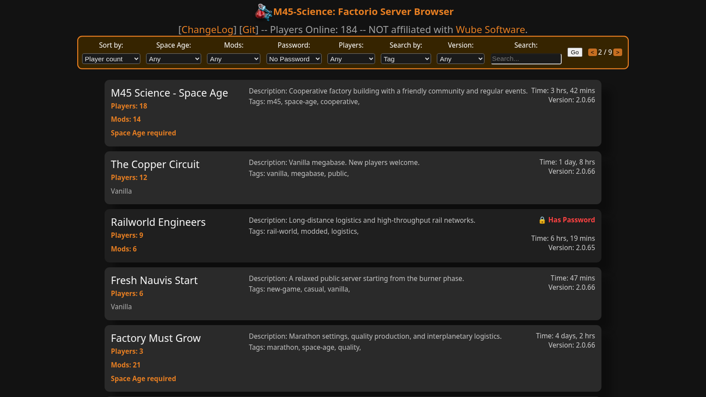

# Web viewer for the Factorio server list, with caching

[Try a live version here](https://list.m45sci.xyz/)



To regenerate the screenshot with deterministic demo server data, run:

```sh
go run ./scripts/render-readme-screenshot.go
```

Chrome or Chromium is required. Set `SCREENSHOT_BROWSER` if its executable is
not available as `google-chrome`, `chromium`, or `chromium-browser`.

Usage of ./goFactServView:

  -httpPort int
  
        port to bind to (default 80)
        
  -httpsPort int
  
        port to bind to for HTTPS (default 443)
        
  -ip string
  
        IP to bind to
        
  -token string
  
        Matchmaking API token
        
  -url string
  
        domain name to query (default "multiplayer.factorio.com")
        
  -username string
  
        Matchmaking API username
        
